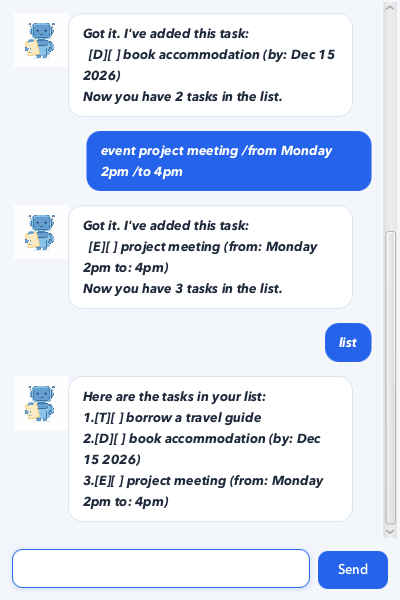

# Chris User Guide

Chris is a desktop task manager for users who prefer fast, text-based commands. It supports todos, deadlines, and events, and saves every change automatically.



## Quick start

1. Install Java 25.
2. Download `chris.jar` and place it in an empty folder.
3. Open a terminal in that folder.
4. Run the following command:

   ```shell
   java -jar "chris.jar"
   ```

5. Enter commands in the text box at the bottom of the window and press `Enter` or click `Send`.

> **Note:** Chris stores tasks in `data/chris.txt`, relative to the folder from which the application is run. Tasks are loaded automatically the next time Chris starts.

## Command summary

| Action | Command format |
| --- | --- |
| Add a todo | `todo DESCRIPTION` |
| Add a deadline | `deadline DESCRIPTION /by YYYY-MM-DD` |
| Add an event | `event DESCRIPTION /from START /to END` |
| List tasks | `list` |
| Find tasks | `find KEYWORD` |
| Mark a task | `mark NUMBER` |
| Unmark a task | `unmark NUMBER` |
| Delete a task | `delete NUMBER` |
| Exit Chris | `bye` |

## Adding a todo

Adds a task without a date or time.

Format: `todo DESCRIPTION`

Example:

```text
todo borrow book
```

Expected response:

```text
Got it. I've added this task:
  [T][ ] borrow book
Now you have 1 task in the list.
```

## Adding a deadline

Adds a task that must be completed by a specific date. Enter the date in `YYYY-MM-DD` format; Chris displays it in a friendlier format.

Format: `deadline DESCRIPTION /by YYYY-MM-DD`

Example:

```text
deadline return book /by 2026-09-30
```

Expected response:

```text
Got it. I've added this task:
  [D][ ] return book (by: Sep 30 2026)
Now you have 2 tasks in the list.
```

## Adding an event

Adds a task with start and end information. Event timings are stored as entered.

Format: `event DESCRIPTION /from START /to END`

Example:

```text
event project meeting /from Monday 2pm /to 4pm
```

Expected response:

```text
Got it. I've added this task:
  [E][ ] project meeting (from: Monday 2pm to: 4pm)
Now you have 3 tasks in the list.
```

## Listing tasks

Displays every task with a number, type, and completion status.

Format: `list`

Example output:

```text
Here are the tasks in your list:
1.[T][ ] borrow book
2.[D][ ] return book (by: Sep 30 2026)
3.[E][ ] project meeting (from: Monday 2pm to: 4pm)
```

`[T]`, `[D]`, and `[E]` represent todos, deadlines, and events respectively. `[X]` means that a task is complete, while `[ ]` means that it is incomplete.

## Finding tasks

Displays tasks whose descriptions contain the given keyword.

Format: `find KEYWORD`

Example:

```text
find book
```

Expected response:

```text
Here are the matching tasks in your list:
1.[T][ ] borrow book
2.[D][ ] return book (by: Sep 30 2026)
```

## Marking a task

Marks the task at the specified list number as complete.

Format: `mark NUMBER`

Example: `mark 1`

```text
Nice! I've marked this task as done:
  [T][X] borrow book
```

## Unmarking a task

Marks the task at the specified list number as incomplete.

Format: `unmark NUMBER`

Example: `unmark 1`

```text
OK, I've marked this task as not done yet:
  [T][ ] borrow book
```

## Deleting a task

Deletes the task at the specified list number. Use `list` first if you do not know its number.

Format: `delete NUMBER`

Example: `delete 3`

```text
Noted. I've removed this task:
  [E][ ] project meeting (from: Monday 2pm to: 4pm)
Now you have 2 tasks in the list.
```

## Duplicate tasks

Chris prevents the same task from being added more than once. Two tasks are duplicates when they have the same task type and description, ignoring letter case. Deadlines must also have the same due date, while events must also have the same start and end details.

For example, entering `todo read book` followed by `todo Read Book` produces:

```text
OOPS!!! That task is already in your list.
```

A todo and a deadline with the same description are allowed because they are different task types.

## Exiting the application

Format: `bye`

Chris displays the following message, after which the window can be closed:

```text
Bye. Hope to see you again soon!
```

## Error handling

Chris explains invalid commands and suggests the required format instead of terminating unexpectedly. For example:

```text
todo
```

```text
OOPS!!! I need a description for that todo. Try: todo borrow book
```

Other invalid inputs handled by Chris include missing event fields, invalid deadline dates, non-numeric task numbers, and task numbers outside the current list.
